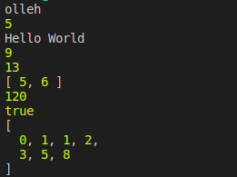

# GMC-JS-Functions

This repository contains a set of javascript functions for string manipulations, array operations, and basic mathematical calculations.

## String Manipulation Functions:

1.  **Reverse a String:** Reverses a given string.
2.  **Count Characters:** Counts the number of characters in a string.
3.  **Capitalize Words:** capitalizes the first letter of each word in a sentence.

## Array Functions:

4.  **Find Maximum and Minimum:**Finds the maximum and minimum values in an array of numbers.
5.  **Sum of Array:** Calculates the sum of all elements in an array.
6.  **Filter Array:** Filters out elements from an array based on a given condition.

## Mathematical Functions:

7. **Factorial:** Calculates the factorial of a given number.
8. **Prime Number Check:** Checks if a number is prime or not.
9. **Fibonacci Sequence:** Generates the Fibonacci sequence up to a given number of terms.

## Outputs:

